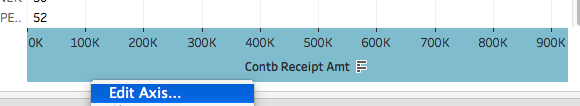

## About
Last Updated: 2018-09-13    
Software Used: Tableau Public 2018.1  
Created by [Sarah Pugachev](https://github.com/sclayton29)  

## Table of Contents
* [Introduction](#introduction)
* [Getting the Data](#getting-the-data)
* [Loading the Data into Tableau](#loading-the-data-into-Tableau)
* [Creating a Map](#creating-a-map)
  * [Renaming a Sheet](#renaming-a-sheet)
  * [Understanding Tableau's Data Structure](#understanding-tableaus-data-structure)
  * [Building the Base Visualization](#building-the-base-visualization)
  * [Adding Filters](#adding-filters)
  * [Refining the Style](#refining-the-style)
  * [Adding An Exposed Filter](#adding-an-exposed-filter)
  * [Editing the Tooltip](#editing-the-tooltip)
* [Creating a Bar Graph](#creating-a-bar-graph)
  * [Adding Data to Rows and Columns](#adding-data-to-rows-and-columns)
  * [Styling Bar Graph](#styling-bar-graph)
    * [Adding Colors](#adding-colors)
    * [Filtering by Count](#filtering-by-count)
    * [Adding Labels](#adding-labels)
    * [Editing the Axis](#editing-the-axis)

## Introduction
This lesson will take you through creating a data visualization with Tableau.

Tableau is a drag and drop tool that allows users to create interactive visualizations without any programming. This can be a helpful way to explore, analyze, or present your data. You can view examples of Tableau visualizations in the [Tableau Public Gallery](https://public.tableau.com/en-us/s/gallery). 

Tableau Public is available for anyone for free, but you have to save your visualizations to the Tableau server. If you have data you cannot or do not want to make public, [academic trials of the full software are available](https://www.tableau.com/academic). 
*Note: You can make your visualizations hidden with Tableau Public. This means no one will easily access your vizs without the direct link.*

If you follow along with this material, by the end of the workshop you will have a visualization that looks similar to the one below. 
 

[Return to Top](#about)

## Getting the Data
For this lesson, we will look at campaign contributions in Oklahoma during the 2016 Presidential Election. 

We will be using freely available data from the [Federal Election Commission](https://classic.fec.gov/disclosurep/PDownload.do). We have done a bit of clean-up work on this data. Namely, we removed all of the individual contributors names. 

*Why would we want to delete the contributors' names from our dataset?*  

Let's download the cleaned data to get started! 
* **[Download the cleaned data](https://github.com/sclayton29/Tableau-2016CampaignContributions/raw/master/data/OKContributions.csv)** 
  * *Note: If the data opens in a browser window, right click and select __Save As__ to save it as a file on your computer*
* Move the downloaded file to another location where you can easily locate it. I'll move the the file to my Desktop. 
* Look over the spreadsheet to get a better understanding of the data we will be using. 

*What are some of the data columns you think would be the most interesting to visualize?*   
*Do you anticipate any problems visualizing this data?*  
*What are some of the research questions you might hope to explore using this data?*

## Loading the Data into Tableau
Now that we have our data downloaded and have thought about our research areas, we are ready to get started.
   
First, let's get our data into Tableau.    
* Open your tableau application. 
* On the left side, under **Connect** and **To a File**, select **Text File**.

*Note: Although you likely opened your file in Excel to view it in the section above. It is actually a [CSV file](https://en.wikipedia.org/wiki/Comma-separated_values), which Tableau classifies as a Text File. If the file had ended with an excel file extension like .xls, you would Connect to Microsoft Excel.*
* In the file explore that pops up, navigate to and select the OKContributions.csv file. Click **Open** to load the data. 
* A preview of the data you just loaded should open in the Tableau window. Look this over quickly to verify that you uploaded the correct dataset. 

## Creating a Map
To create our first visualization, with this data, select **Sheet 1** in the bottom left corner. 
### Renaming a Sheet
Before we do anything else, let's rename Sheet 1. 
* Right click on **Sheet 1** at the bottom of the window. 
* Select **Rename**. 
* Enter a new name. For this example, we will use **Map**. 

### Understanding Tableau's Data Structure
Now, look at the left side panel to see how our tabular data has been transformed into **Dimensions** and **Measures**. Each column name has assigned to one of these categories. To the left of each column name is a symbol to indicate the data type. **Abc** indicates textual data, the **calendar** icon symbolizes dates, the **globe** means spatial data, and the **hashtag** indicates numerical data.  

*What exactly is the difference between dimensions and measures in Tableau?*  

According to the [Tableau Online Help](https://onlinehelp.tableau.com/current/pro/desktop/en-us/datafields_typesandroles.html):

>"Dimensions contain qualitative values (such as names, dates, or geographical data). You can use dimensions to categorize, segment, and reveal the details in your data. Dimensions affect the level of detail in the view. Measures contain numeric, quantitative values that you can measure. Measures can be aggregated. When you drag a measure into the view, Tableau applies an aggregation to that measure (by default)."

Overall, Tableau does a pretty good job of putting data columns into the correct categories and correct data type classifications. However, if you ever want to change the category or data type, you can right click on field to change it. 

Luckily, Tableau provides some features to help us figure out when kind of data to use. On the right side of the Tableau window, you should see icons of different visualization types. *If you don't see this, click __Show Me__ in the upper right corner of the screen.* You can hover off the different visualization types to see what data types are recommended. 

Hoover over the symbol map (second row, first on left) to see that recommended data types. 

Based on Tableau's guidance, we know that for symbol maps, we will need on 1 geo dimension and can add more dimensions and measures. 

### Building the Base Visualization
To create a visualization, we need to drag and drop data on the map. 

* Click on the **Contrbr Zip** under Dimensions on the left sidebar. Drag it over to the center **Drop Field Here.**
  

* Because, Tableau has classified this field as a geographical data dimension. A map was automatically selected as the data visualization. 

  *Note: This data should only contain Oklahoma contributions, but a few dots pop up in other parts of the country. What do you think is going on here? How would you investigate further?*
  
  * _Tableau can help us identify problematic data. Click on the point that appeared in New York state. Then, select the **View Data** button on the far right of the pop up window. In the View Data window, select the **Full Data** tab at the bottom. This will show up the data this point is based on._
  

* Click on the newly created map, to see some map controls in the left corner. Click on the **plus sign** to zoom in closer to Oklahoma. Move the map around by holding down **Shift** while clicking and dragging the map. 

*How would you describe this map to a colleague? What does it show?*  

Let's add some more data to our map. The zip codes have illustrated where the donation are originating, but how large are these contributions? We can add additional data into the **Marks** panel located in between the data fields and the map. 
* Select **Contb Receipt Amt** located under **Measures**. Drag it it to **Size** under **Marks.** After doing this, you dots on the maps should be sized based on the amount contributed, and **SUM(Contb Re)** should be listed under **Marks** with the size icon to the left of it. 

Notice the map has changed. 

*Does anything seem strange about this map? Pay attention to the legend that appears on the right side of the window.*  

Open up your original data and try to figure out why it starts at -$2,700. 
*How would you approach or explain this issue?*

Also looking at the map, we may notice that most of the dots are quite small. Looking at the scale in the legend, notice that it goes up to 322,873. Looking at our data, we can see that this is an unusually large individual contribution. Let's adjust the scale to show a bit more of the nuance in the smaller donations. 
* To adjust the scale, click the down arrow on the top of the legend box and select **Edit sizes**.

 

* In the drop down menu under **Sizes vary** select **By Range**. 
* Check the **End value for range** and edit the text box to be 150,000. 

 

* Click **OK** to apply these changes.   
*Take a look at the legend to see how values over 100,000 were handled.*

### Adding Filters 
If you look back at your the original spreadsheet, you will notice that this dataset includes information about donations to many different candidates. Let's add a filter to only show contributions to Trump and Clinton. 
* Find **Cand Nm** under **Dimensions** and drag that to the **Filters** box (located right above the marks box).
* In the dialog box that appears, select **Clinton, Hilary Rodham** and **Trump, Donald J.**.
* Click **OK** to finalize the filter. 
* **Cand Nm** should now appear in your filter box, and your map should have updated to only show contributions to Trump and Clinton.   
 
   
*Note: If you want to go back and edit this filter, you can use the down arrow next to Cand Nm.* 

Sometimes when you add filters, you can miss the way the visualization changed. Luckily, Tableau has undo and redo functionalities that allow you to quickly reverse and re-implement what you just did. You can either use your normal keyboard shortcuts (like Cmd + Z on Macs) or use the back and forward arrows at the top left of the screen. Try to undo and redo adding the filter and pay attention to how your map changes. 

 

Before moving on, we want to set this filter to be applied to all of the related visualizations we will create. 
* To do this, click on the down arrow next to Cand Nm. 
* Select **Apply to Worksheets**.
* Then, select **All Using This Data Source**.

 

### Refining the Style
Notice that after we updated the filter, the scale we selected for our SUM(Contb Receipt Amt) doesn't seem as approriate. Let's go back into our legend and edit it. 
* Go the the SUM(Contb Recepit Amt) legend on the right size of the screen. 
* Click on the box and select the **down arrow**. 
* Select **Edit sizes**.

 

* In the dialog box that appears, select **Automatically** from the dropdown under **Sizes vary**. Also, uncheck the **End value for range** box. We lose a bit of control over the sizes this way, but we will not have to continually update the sizes as we add filters.   
* Click **OK** to apply your changes. 

 

SUM(Contb Recepit Amt) is not a very intuitive title for this legend. Let's change it to make it more understandable for viewers. 
* Click on the **down arrow** next to the title. 
* Select **Edit Title**.

 

* In the text box, that appears enter the title you want to use. For the example, we will use **Contribution Amount**.
* Click **OK** to save your changes. 

Let's now add an element to differentiate between Clinton and Trump's contributions. Using two different colors seems like a good choice. 
* To add colors based on the candidates, drag **Cand Nm** to the **Color** box under **Marks**.
* The map should update to show two different colors, and a legend for Cand Nm should appear on the left. Using the same steps, we used above for the Contribution Amount, update the title of this legend to **Candidate**. 

We may also want to update the colors. Since red is commonly used to represent the Republican party and blue the Democratic party. Let's make Clinton blue and Trump red. 
* Click on the down arrow in the candidate box and select **Edit colors**.  
* Select **Clinton, Hillary Rodham** on the left and blue on the right to assign the color. 
* Repeat with **Trump, Donald J.** and red. 
* Click **OK** to save your changes. 

 

*Note: There are almost always multiple way to do a task in Tableau. In the example above, you could have also edited the colors by clicking the __Colors__ under __Marks__*. 

### Adding an Exposed Filter
We may also want to filter based on date to see if the contributions changed over time. 
* Add a filter using the **Contb Recepit Dt** dimension. 
* After you drag the field to the filter box, a dialog box will open asking you how you want to filter. Select **Range of Dates** and then **Next** to continue adding the filter. 

 

* In the next dialog box that appears, keep all the default settings and click **OK** to apply it.  

Your map should not change after applying this filter. After all, we selected all of the existing values. 

One of the benefits of Tableau is its interactivity. So, let's expose this filter as an option of users to explore the data. 
* Select the down arrow next to **Contb Receipt Dt**.
* Then, select **Show Filter**.

 

Notice that this filter appears on the right side with slider that will allow you to sort through the dates. Play around with the slider and see how the map changes. Notice how the contribution amount legend also adjusts. 

*What are the pros and cons of this auto adjustment in the Contribution Amount legend?*

As you  explore the date slider's functionality, you may notice that in the early dates there are not contributions that show on the map. We can exclude that time frame by forcing the filter to only include non-Null values. 
* Using the down arrow by the **Contb Receipt Dt**, select **Only Relevant Values**. 

 

* Go ahead and also change the title of **Contb Receipt Dt** to something more easily understandable. 
* Also, set this filter to apply to all worksheets using this dataset. 

### Editing the Tooltip
Before we move on to our next visualization, let's edit the tooltip. The tooltip is the pop up that occurs when you click on a point on your map. 
* Try clicking on a point to see what show ups. 

* To add another field to our tooltip, we need to drag that field onto the **Tooltip** box under **Marks**. 
* Try doing this with the **Contbr City** dimension. 
* Hover points to see the added info. 
* Like with our legend titles we want our tooltip to be as clear as possible. To edit the language used in the tooltip, select **Tooltip** in the **Marks** panel. Go ahead and update the terms used on the tooltip. *Note: The values in gray, surround by <> are pulling the data from the approriate fields. I would not recommend editing these. Edit the values before the : however you would like.* 

## Creating a Bar Graph
When you were looking at the data, you may have notice a few columns about the contributor's occupation. Let's dig into this some more using a bar graph. 

First, we need to create a new sheet to create our graph. 
* Next to **Map** in the bottom left corner, select the icon that looks like a **bar graph with a +**.

 

* A blank sheet will open up. Rename the new sheet to something like **Professions**. 

### Adding Data
For the bar graph, we will need to add data, to rows and columns boxes near the top of the window. 
* Drag **Contb Occupation** to Rows and **Contb Receipt Amt** to Columns. 

 

Recognizing the type of data added, Tableau should automatically create a bar graph. 

### Styling Bar Graph
There are a lot of distinct values for professions in this dataset. We will not be able to view all of them at the same time. So, let's sort our data to show the most common at the top. 

 

#### Sorting by Most Common Responses
When you hover over the top of the chart, an icon that looks like a bar graph will appear. Click this **icon**. Your data will be re-sorted with the most common professions at the top. 

#### Adding Colors
Let's add some colors to indicate the different candidates. Use the same steps you used on the map above. *Note: The colors should automatically match what we selected for the map.*

#### Filter by Count
Since we are not trying to make individual's easily identifiable, we may want to limit specific professions that only appear a few times.

* Drag **Contbr Occupation** to **Filters**. 
* Create a filter that includes all the occupations. 
* Select the down arrown next to **Contr Occup...** under **Filters**.
* Select **Measure** and then **Count**.  

 

* In the dialog box that appears, enter **50** as the low value. 
* Click **OK** to apply. 

 

#### Adding Labels
Our bar chart is showing the amount contributed from each group of occupations. We may also be interested in the number of individual contributions. We can add this information as a label. 

* Drag **Contbr Occupation** to **Label** under **Marks**. 
* Then, click on the down arrow next to **Contbr Occupation** under **Marks**.

 

Now, we should see counts on most of our labels. Some counts may not appear because their isn't enough space to display them. 

#### Editing the Axis
We can see the Retirees contributed far more money than other group of profession. Our current chart makes this very clear. Unfortunately the wide range between the contribution amounts of Retirees vs. the groups at the bottom of our chart make it challenging to see the data for the bottom groups. We can try out different axis views to see alternatives to displaying this data. 

* Click on the x-axis and select **Edit axis**. 

 

* Select **Logarithmic** under **Scale**. 

 

* Click the red **x** at the top left of the dialog box to exit. 

* Observe the changes to your bar graph. 

  * *How is this chart different?*  
  * *What are the advantages of each of the axis views (standard and logarithmic)?*
  * *What problems do you anticipate with viewers' interpretation of each view?*

* Select the axis version you would like to use. For this example, we will revert back to the standard view. 

### Assembling a Dashboard
Dashboards are a method to combining different Tableau visualizations in one view. 

* Select the new dashboard button located next to the new sheet button at the bottom left of the screen. 

 

## Sizing the Dashboard
On the left panel of the dashboard, you should see a **Size** option. 
* Select the down arrow next to size to see the available options. 

 

Notice that you can size your dashboard by range, fixed size, or automatic. For this example we will select automatic. 

* In the dropdown menu next to Range, select **Automatic**. 

## Adding Sheets to Dashboard
Under the size option, you should see see a **Sheets** section. 
* In true Tableau fashion, drag the **Map** sheet over to the main panel. 
* Now, drag the **Professions** sheet over as well. As you are dragging it over, notice that Tableu will give you a preview of the sheet's placement. Hover until it is below the map, then release your mouse to place it there. 

## Adding a Text box
Since we want to be transparent about our process, we can add a text box to the blank area of our dashboard to explain our data source and process. 

* Under **Objects** on the left-side panel, select **Text** and drag it over to the blank spot on your dashboard. 
* In the dialog window that appears, enter a brief statement about your data and process. 
* Click **OK** to add your text. 

## Filtering by Charts
One of the great elements of Tableau is the the ability to filter by visualizations. 

* Click on the **Professions** bar graph. 
* On the left side, click the Use as Filter icon. It should be the third option and looks similar to half an hourglass. 

 

Now test this filter out, by selecting different elements of the bar graph like a specific profession or the red portion of a specific profession. 

* Apply the use as filter option to your map as well. 

## Re-arranging the Dashboard
Finally we can re-arrange our dashboard to maximize our space. We won't give specific instructions in the section. Instead will will provide some tips, and let you decide the best way to arrange it. 
* You can reposition a box by clicking on it, hover over the gray bar that appears in the top center, and then dragging it to your preferred location. 
* If you select the edge of the box, instead of the gray bar, you can resize the box. 

 

* Also, when you click on a box, there should be a down arrow that appears. 
* Select this and explore the different options that appear. 
  * Try the **Title** and **Floating** options to see what they do. Don't forget the Undo option if you don't like you changes.

 
 

# Saving Your Visualization
Once you are satisfied with your dashboard, it is time to save it. 

* To Save, navigate to the **File** menu at the top left and select **Save to Tableau Public As**. 

 

* In the dialog box that appears, enter a name for your project. 
* Click **Ok**. 
* If you are not already signed into Tableau Public, you will be asked to enter your log in information. You can also sign up for a Tableau Public account at this point. 
* After saving you, will be directed to your visualization as saved on Tableau Public's server. 
* From here you can update the metadata and share out your visualization. 

Congrats! You have completed your first Tableau Visualization! 
